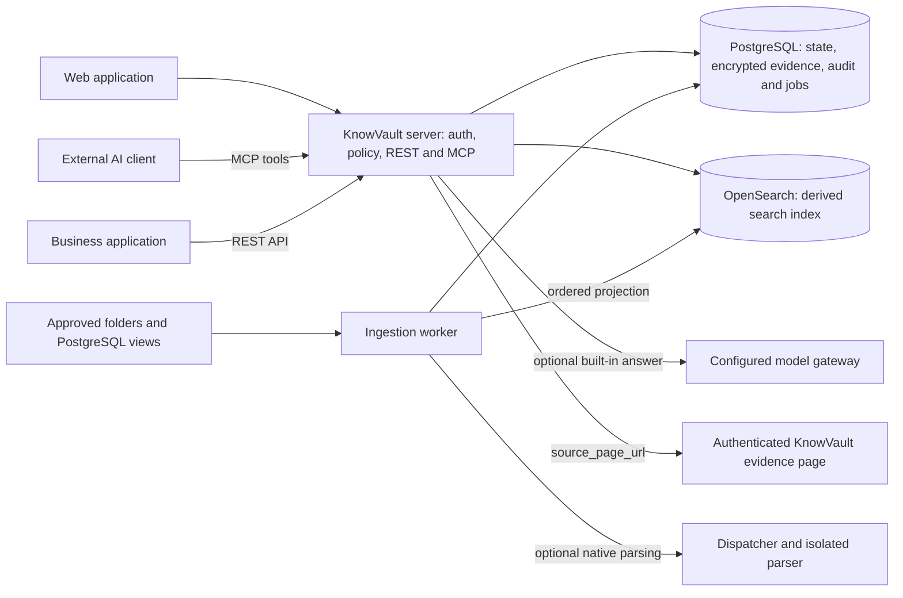

# KnowVault architecture

KnowVault gives employees and AI agents permission-aware access to company data,
with versioned evidence and audit. The web application, authenticated MCP and
REST API share the same authorization and evidence services.

This document records component responsibilities and technical invariants.
[Pilot status](docs/PILOT-STATUS.md) defines current support and measured limits;
[HLD](docs/HLD.md) explains the user-to-evidence flow and [LLD](docs/LLD.md) maps it
to code. Product boundaries remain in the [constitution](PRODUCT_CONSTITUTION.md),
accepted [ADRs](docs/adr/README.md), [safety rules](POKA_YOKE.md) and
[machine guardrails](architecture/guardrails.yaml).

## 1. Runtime composition

The application is a Go modular monolith with separate process capabilities:

| Component | Responsibility and activation |
| --- | --- |
| `knowvault-server` | Serves the static web UI, OIDC/session endpoints, REST and MCP; checks access and runs search, evidence reads and optional questions. |
| `knowvault-worker` | Claims durable ingestion, synchronization, indexing and maintenance jobs. Source adapters run within this boundary. |
| `knowvault-operator` | One-shot bootstrap, migrations and operational commands; no long-running public service. |
| `knowvault-purger` | Separately configured privileged retention processing. |
| `knowvault-sandbox-dispatcher` | Implemented broker for isolated parser execution; used by the optional native-ingestion deployment. It does not create containers. |
| `knowvault-connector` | Reserved executable scaffold. Its presence does not establish a deployable remote-segment connector agent. |

The optional native profile uses an external Linux supervisor to start the
pinned document-parser workers. The application worker receives only the
submit capability. Admission, execution identity, limits, deadlines and verified
exit remain dispatcher responsibilities. See [native ingestion](docs/NATIVE-INGEST.md)
and the [supervisor contract](deploy/supervisor/README.md).

`allowed_binaries` is a closed command inventory, not a list of running services.
Each deployed component also needs its declared image, configuration, capabilities
and readiness checks.



External AI clients choose their own model. Built-in answer configuration does
not control where an independent client sends retrieved data.

## 2. Stack and supply chain

| Layer | Current implementation |
| --- | --- |
| Web UI | React and TypeScript, bundled by esbuild and served as static assets by Go. |
| Application | Go, with pgx for PostgreSQL access and the repository's canonicalization contracts. |
| Authoritative storage | PostgreSQL: tenant data, encrypted artifacts, jobs, outbox and audit. |
| Search | OpenSearch for lexical and vector projections; profile-bound embedding adapters. |
| Native documents | Isolated Apache POI/PDFBox document worker for the provisioned Office/text-PDF profile. |
| Additional parsing | Tesseract/OCR and other parser implementations have separate contracts; they are outside pilot qualification. |
| Models | Operator-configured local or explicitly permitted external answer profiles; the current Compose embedding service is CPU-based. |
| Deployment | Pinned OCI images, Compose, customer OIDC and mounted trust/secrets; the development stack includes Keycloak and TLS proxies. |

The exact dependency versions, artifact digests, model identities, licenses and
activation states live in [versions.json](architecture/versions.json) and
[licenses.yaml](architecture/licenses.yaml). A registry entry, source adapter or
parser implementation does not itself qualify a release capability. The current
profile and its limits are described in [Model profiles](docs/MODEL-PROFILES.md)
and [Native ingestion](docs/NATIVE-INGEST.md); Tika, PaddleOCR or a particular
Qwen/vLLM stack are not mandatory components of the pilot.

Builds use the pinned Go toolchain with `GOTOOLCHAIN=local` and
`GOEXPERIMENT=jsonv2`. Node.js is a build dependency, not an application runtime.
Exact parser ownership and anchor requirements are in
[PARSER_CONTRACTS.md](docs/PARSER_CONTRACTS.md).

The supply-chain guardrails reject unpinned dependencies/images, floating tags,
unreviewed license exceptions and undeclared runtime downloads. Local checks and
protected hashes detect drift; remote review policy and release provenance are
separate controls and must be configured explicitly. See [Testing](docs/TESTING.md)
and [Contributing](CONTRIBUTING.md).

## 3. Code and dependency boundaries

[LLD](docs/LLD.md#1-repository-layout) is the maintained package and executable
map. Domain types and invariants remain separate from transport, persistence,
source adapters and runtime composition. Transport calls use cases; repositories
own database transactions; composition wires their capabilities.

OpenSearch access belongs to `internal/search`; built-in generation belongs to
`internal/modelgateway`, with embedding access in its dedicated adapter. Mounted
keys and trust roots are consumed through purpose-scoped platform boundaries.
No UI filter, model prompt or source-provided identifier can establish authority.

## 4. Module Boundaries

| Module | Owns | Does not have the right to |
|---|---|---|
| identity | principals, groups, sessions, external identity mapping | automatically grant data access to an administrative role |
| policy | a unified allow/deny solution and its reasons | trust UI filters or prompts |
| workspace | workspaces, membership, revision, bindings | copy evidence into a workspace |
| source | connections, scopes, source objects, versions, ACL snapshots | perform a write operation in the source |
| connector | read-only protocol and capabilities | execute an arbitrary command from the server |
| ingestion | the version processing state machine | index before ACL resolution |
| evidence | fragments, anchors, hashes, context rules | reference a mutable SourceObject directly |
| search | server-built filters, hybrid retrieval, post-auth | accept a tenant/workspace filter from the client as trusted |
| question | the Question Run pipeline and immutable result | read a previous Question Run as prompt context |
| modelgateway | schema-validated model calls | pass credentials, arbitrary execution or unrestricted network authority to the model |
| audit | append-only security events | store full source content or model context |
| purge / recovery | retention and operational recovery | return purged data to active retrieval |
| jobs | leases, retries, outbox, dead letter | confirm a job before atomic result storage |

## 5. Storage

### PostgreSQL

Stores:

- organizations, principals, groups, and external identities;
- workspaces, revisions, members, connections, scopes, and bindings;
- source objects, versions, ACL snapshots, anchors, and hashes;
- Question Runs, claims, citations, manifests, and source watermarks;
- durable jobs, leases, transactional outbox;
- append-only audit chain;
- retention and purge state.

Each organization-owned table contains `organization_id NOT NULL` and is protected by Row-Level Security. The API transaction begins only after a verified organization context is established.

### OpenSearch

A separate server-generated index namespace is created for each organization. The workspace does not create its own copy of the data.

Active Index Document:

```text
organization_id
scope_memberships[] nested {
  source_scope_id
  source_scope_revision
}
source_object_id
source_version_id
extraction_id
extraction_profile_hash
evidence_fragment_id
object_type
search_text
language
principal_token_digests
digest_key_version
content_hash
source timestamps
embedding_profile_hash
index_generation
generation_fence
embedding[profile dimension]
visibility = STAGED | ACTIVE | REVOKED
```

Display title, locator, anchor, and deeplink are loaded from envelope-encrypted PostgreSQL only after post-authorization. Raw email/group/source principals in OpenSearch are prohibited; prefilter uses organization-scoped versioned HMAC digests. `search_text` is an honestly designated derived searchable projection and may include permitted organization policy title text, but does not create a separate unencrypted stored/display field.

Search combines the available lexical, entity and profile-bound vector channels through ranked fusion. The active profile declares the channels used and degradation; reranking is not an unconditional pilot dependency. Mandatory filters are built by the server:

```text
organization
∩ workspace bindings
∩ ACTIVE evidence
∩ exact `(source_scope_id, source_scope_revision)` pairs from WorkspaceRevision
∩ ACL tokens if access mode = SOURCE_ENFORCED
```

After OpenSearch, each candidate re-authenticates against the current PostgreSQL state. The index is an accelerator, not the source of the access decision.

Vector space belongs to the exact immutable embedding profile, not just dimensions. Each index document contains `embedding_profile_hash` and generation fence; query vector, active PostgreSQL search-profile pointer, and OpenSearch alias must exact-match. Replacing the embedding model/profile fixes the catalog/outbox watermark, builds staged generation, and replay/dual-apply brings it to activation cut without sequence gaps, and only then atomically switches the pointer+alias. Stale-generation writes are fenced. Mixing vectors of different weights/tokenizer/pooling/profile even with identical dimensions is forbidden.

### Persistent object storage

In the base delivery, a separate persistent object storage is absent. Original binaries are processed in encrypted ephemeral storage with a limited TTL and do not enter backup. Sensitive derivative artifacts are stored envelope-encrypted in bounded PostgreSQL `bytea`/TOAST; the searchable projection resides in OpenSearch on an encrypted customer volume. The external S3 artifact adapter is not included in 1.0 and requires a separate ADR/version/license lock.

The system stores derivative text fragments, embeddings, metadata, hashes, and exact cited excerpts. This is directly shown to the administrator; the formulation "we do not store data at all" is forbidden.

## 6. Access Model

```text
effective access =
  active organization membership
  ∩ workspace membership and role
  ∩ workspace source scope
  ∩ current organization policy
  ∩ agent/service operation scope
  ∩ source ACL where supported
  ∩ active object state
```

Source scope has one mode:

- `WORKSPACE_MANAGED`: the scope owner makes a separate explicit grant of read access to derivative data for workspace participants. This is not source-native ACL and should not be named as such; inclusion requires a warning, confirmation, and audit event;
- `SOURCE_ENFORCED`: identity mapping and the current source ACL are verified over the workspace.

Unknown identity, unknown ACL, or expired ACL in `SOURCE_ENFORCED` mode means deny.

One SourceObject can simultaneously belong to multiple overlapping SourceScopes and their revisions. It and its vectors are not duplicated: membership is stored as M:N `source_object_scope` with exact `source_scope_revision`, and the index contains a nested projection `scope_memberships[]`. Search filter and post-authorization check the exact revision pair from the immutable WorkspaceRevision. Membership of an old broad revision never satisfies binding of a new narrowed revision. Presence of WORKSPACE_MANAGED membership in another, unconnected scope/revision does not expand the SOURCE_ENFORCED path.

Upon opening a saved Question Run, a new read gate is performed for all significant citations. The Reader must be a current member of the workspace, and each citation must be reachable via at least one ACTIVE membership matching the enabled binding of the **current** WorkspaceRevision. For `SOURCE_ENFORCED`, current identity mapping and ACL are checked on top of this. The historical workspace/source revision from the Question Run is used only for provenance and never authorizes reading after narrowing or scope removal. If at least one citation fails this gate, version 1.0 does not show partial text and suggests running the question again in the current access context.

## 7. Connector Contract

The current pilot uses mounted folders and prepared PostgreSQL views. Git and IMAP adapters exist outside pilot qualification. The following capability vocabulary defines the extension boundary; it is not a claim that every connector or the remote connector-agent executable implements every operation. See the [connector roadmap](docs/CONNECTOR-ROADMAP.md).

Source-specific immutable scope schemas, Folder/Git/Mail/Site settings and their SSRF/path/MIME safeguards are normative in `docs/SOURCE_CONTRACTS.md`.

Before access mode verification, each scope passes a single connection trust gate: exact connection revision, connector build/version/artifact, capability-profile hash, contract-suite hash, verified-at, and trust-profile hash. This is mandatory for `WORKSPACE_MANAGED`; the absence of source-native ACL does not permit an unverified connector build.

Each connector declares capabilities and implements:

```text
test_connection
list_scopes
validate_scope
full_scan
incremental_scan(cursor)
read_metadata(object_id)
read_content(object_id, version)
read_permissions(object_id)
build_deep_link(object_id, version, anchor)
health
close
```

Capabilities:

```text
stable_object_ids
native_versions
incremental_cursor
webhooks
item_level_acl
historical_versions
deep_links
deletion_events
local_extraction
```

Remote connector-agent design requirements (the separate executable remains a scaffold):

- is installed only when the main worker does not see the source;
- accepts only signed tasks from a pre-approved scope;
- opens only outgoing mTLS connections;
- has no shell/exec endpoint;
- contains no model;
- does not save source files after processing;
- cannot extend the scope from a server task.

## 8. Ingestion state machine

```text
DISCOVERED
 → METADATA_READ
 → ACCESS_RESOLVED
 → CONTENT_READ_EPHEMERALLY
 → EXTRACTED
 → FRAGMENTED
 → EMBEDDED
 → INDEX_STAGED
 → ACTIVATED
```

Error states:

```text
QUARANTINED · ACL_UNKNOWN · CONTENT_UNAVAILABLE
EXTRACTION_FAILED · EMBEDDING_FAILED · INDEX_FAILED · DELETED
```

A new version or re-extraction becomes readable only after successful authoritative publication of its extraction set. `SourceExtraction` fixes the parser/normalization profile, retention fence and evidence-set hash. The active-extraction pointer selects a `SUCCEEDED` set with readable retention state for new questions. Current version/extraction pointers switch transactionally in PostgreSQL; an ordered outbox projects the new set into OpenSearch. The index command carries its version fence/sequence, and the applier rechecks PostgreSQL state and discards stale commands. Read-time authorization checks the version, extraction and retention state despite indexing delay. Explicit historical reads have their own retained-version contract; they do not make an old version current.

Reprocessing an unchanged SourceVersion creates a new Extraction, rather than replacing EvidenceFragment in place. The historical citation continues to reference the previous `extraction_id` and `evidence_fragment_id`; new questions use only the active Extraction. Parser/OCR upgrade does not change the source version and does not break the old Answer Manifest, but the read-time resolver shows a separate technical status `EXTRACTION_SUPERSEDED` and proposes a new Question Run.

Upon reducing permissions or upon proven `SOURCE_OBJECT_DELETED`, `queryable = false` is first set in PostgreSQL, then the index is asynchronously cleared. `SCOPE_MEMBERSHIP_REMOVED` closes only the exact `(source_scope_id, revision)` membership and does not disable the common SourceObject as long as another ACTIVE membership exists. The cleanup error worsens health but does not expose the object due to post-authorization.

## 9. Durable jobs without a separate queue

PostgreSQL contains tables `job`, `job_attempt`, and `outbox_event`.

- sampling via `FOR UPDATE SKIP LOCKED`;
- lease with owner and deadline;
- idempotency key for each external event;
- bounded retries with an explicit backoff policy;
- dead letter after attempts are exhausted;
- heartbeat for long-running operations;
- result and outbox are written in a single transaction;
- a lost worker does not lose the job after the lease expires.

Temporal or message broker are considered only after measured exhaustion of this model.

## 10. Question Run pipeline

Search and evidence reads work without built-in generation. The current named-profile answer path uses the bounded `TOOL_LOOP` mode; `EXTRACTIVE` and `GENERATIVE` retain their distinct mode-specific contracts. See [Model profiles](docs/MODEL-PROFILES.md) and [Canonicalization](docs/CANONICALIZATION.md) for their exact inputs and persisted result shapes. Built-in answers remain preliminary: a valid citation does not by itself prove semantic correctness or completeness.

The following describes the contract for snapshot-based answer modes, not a requirement that every request invoke all model stages:

```text
Question
 → policy precheck
 → workspace/source health snapshot
 → query embedding
 → BM25 + vector retrieval with mandatory filters
 → post-authorization
 → context expansion
 → reranking
 → signed answer-mode branch
    ├─ EXTRACTIVE → deterministic authorized-context projection
    └─ GENERATIVE → structured answer draft → structural citation validation
 → terminal validation
 → immutable persistence
 → answer page
```

For `EXTRACTIVE` the server signs the Answer Manifest pair `(answer_mode, verification_method)`, builds the plan only from the authorized context snapshot, and publishes the assertion as a byte-exact projection of exactly one canonical sentence citation. In this mode, generator, verifier, their model runs, and claim-verification records are prohibited; UNKNOWN remains server-owned. The model pipeline below applies only to `GENERATIVE`, where `SEMANTIC_VERIFIER` and corresponding exact profile/run bindings are permitted. A declared mode must have its required runtime dependencies and authorization; unsupported modes fail explicitly rather than silently selecting another profile.

For `GENERATIVE` the generator receives only permitted evidence blocks and returns JSON according to the schema. It does not receive network, tools, credentials, or previous Question Runs.

Model output is not ready Markdown. In `GENERATIVE` the model returns atomic `claims` and `sections` only with links to claim IDs; a separate insufficient/status flag and model-controlled section title are forbidden to it. After verification the server deterministically computes terminal status, and `answer-renderer-v1` builds the document AST and canonical Markdown from verified claim text, fixed server tags Fact/Inference/Unknown and persisted Citation according to the exact grammar `docs/CANONICALIZATION.md`. Model text is never parsed as Markdown/HTML. Free model paragraph, heading, HTML, URL, or citation number in renderer are not accepted.

`corpus_snapshot` is a complete snapshot of the set of sources, not a list of only successfully read sources. For each enabled binding, there exists exactly one immutable WorkspaceRevision entry with the same pair of `(source_scope_id, source_scope_revision)`, `scope_config_hash`, and access mode; extra, skipped, and duplicate entries are prohibited. An inaccessible source remains in the snapshot with an erroneous health status and makes the corpus `PARTIAL`, so it cannot be hidden by deleting a line from the manifest.

Validator checks:

1. evidence ID was in context pack;
2. source version was current in snapshot;
3. anchor is allowed and hash matches;
4. user still has access;
5. evidence semantically supports the actual phrase;
6. dates, numbers, and units match.

For each published FACT/INFERENCE in the `GENERATIVE` verification contract, the server preserves an immutable ClaimVerification: hash of the exact text, canonical input with the exact evidence/support set, strict verifier output, and the selected ModelRun. The Model Gateway stores canonical input/output encrypted with limited retention; audit receives only IDs/hashes. It is impossible to change the text or citations after the verifier and preserve the same claim ID.

The final post-authorization gate preserves the full encrypted `authorized-candidate-set-v1` until reranking and `retrieval-authorization-v1` after final-context selection. Each candidate/grant exact-match is verified against enabled WorkspaceRevision binding, ACTIVE object-scope membership, persisted PolicyDecision and WorkspaceManagedConfirmation or a fresh AclSnapshot with real principal-token intersection. Snapshot strings `ACTIVE/ALLOW` are not authority. Even a zero-context run requires a fresh PrincipalSetSnapshot. SOURCE_ENFORCED evidence without a fresh ACL does not enter the snapshot even with `corpus_status=PARTIAL`; stale index hit, old Extraction or revoked membership are rejected.

Reranker receives the entire authorized candidate artifact, not the already trimmed final context. Snapshot exact-match links the candidate hash, selected embedding/reranking ModelRun IDs, and recomputed output hashes with the server-created execution-plan hash. All model attempts belong to this plan, reside within the QuestionRun interval, and adhere to phase order. The Manifest signs the snapshot hash and the exact-match QuestionRun aggregate, so provenance cannot be replaced by self-consistent JSON fields.

An unverified phrase is removed or results in `INSUFFICIENT_EVIDENCE`. A partial source establishes an independent `corpus_status = PARTIAL`, even if `result_status = COMPLETED` and the generated text are correct.

## 11. Immutability and Relevance

After completion, updates cannot be made:

- question text;
- answer body and structured claims;
- model/retrieval configuration;
- citations, excerpts, anchors and source watermarks;
- answer manifest.

Idempotency of Question Run creation is determined by the pair `(organization_id, actor_id, Idempotency-Key)`:

- the same key and the same canonical request hash return the same run, including terminal run;
- the same key and a different body return `409 QUESTION_IDEMPOTENCY_CONFLICT`;
- a new key creates a new run;
- identical question text with different keys always creates different runs.

A separate resolver computes the current citation state:

```text
CURRENT · SUPERSEDED · EXTRACTION_SUPERSEDED · EXTRACTION_PURGED · DELETED · UNREACHABLE · ACCESS_REVOKED
```

It does not change the old answer. `EXTRACTION_SUPERSEDED` is allowed only while historical Extraction retention remains `ACTIVE/queryable`; `PURGING/PURGED` provides `EXTRACTION_PURGED` and blocks answer body/excerpt. `Run again` creates a new ID and an optional link `supersedes_question_run_id`.

Storage immutability does not equal perpetual disclosure rights. For `DELETED`, `ACCESS_REVOKED`, or `EXTRACTION_PURGED`, the API returns only safe metadata and status; answer body and cited excerpts are not provided. For `SUPERSEDED`, `EXTRACTION_SUPERSEDED`, and `UNREACHABLE`, the old response may be shown to an authorized user with an explicit warning.

Retention is divided into two privileged state machines, inaccessible to a standard application role:

- `QuestionRun purge` uses explicit retention aggregate. Transition `ACTIVE→PURGING` first prohibits disclosure, then removes only question-owned answer body, cited excerpts, and manifest content snapshots; `PURGED` is permitted only after verifying the absence of bytes. Tombstone, hashes/signature, and minimal audit metadata remain. It never removes shared SourceExtraction/EvidenceFragment that other runs and workspaces may use;
- `SourceVersion derived-data purge` uses version-level retention aggregate and monotonic fence: first increases the fence, irreversibly prohibits new Extraction, sets retention/queryability for a specific version and the exact set of all its Extraction to fail-closed, cancels old leases, and clears the active Extraction pointer specifically for this SourceVersion. Late terminal commit must replay CAS; stale index add is discarded by the ordered outbox applier. Only after completion/cancellation of old jobs and verification of the absence of PostgreSQL encrypted artifacts/OpenSearch projections purge becomes `PURGED`. `SourceObject.queryable=false` is set only if the purged SourceVersion is still current or the logical object itself is deleted; purging a historical version does not disable the new current version.

No purge is considered a regular Question Run edit and never returns an object or extraction set to active retrieval.

All offsets, hashes, signatures, and canonical JSON are defined in `docs/CANONICALIZATION.md`. The implementation is not allowed to choose its own offset unit or JSON fields order.

## 12. Audit

Audit stores strict `audit-event-v1`: actor, on-behalf-of, action, resource, workspace, request ID, policy decision ID, outcome, evidence IDs, and only allowlisted metadata. The hash of each event is recalculated from the full canonical event body; the checkpoint builder re-verify the schema, body hash, and the entire contiguous chain, rather than trusting stored first/last hashes. Events are linked `previous_event_hash → event_hash`.

Audit does not store the full question, answer, source text, model context, token, or secret by default. Access to security metadata does not imply access to user content.

Manifest, connector event, and audit checkpoint use purpose-scoped Ed25519 keys with lifecycle `ACTIVE→RETIRED` or `REVOKED`. Exactly one ACTIVE key may sign a specific purpose/scope; RETIRED remains verify-only, so rotation does not break historical responses; REVOKED is fail-closed. Server/agent private keys are stored only in customer secret/KMS/HSM; PostgreSQL stores public records and key IDs.

The local audit hash chain is periodically closed signed `audit-checkpoint-v1` and exported to at least one verified customer append-only sink (WORM/immutable on-edge archive/SIEM receipt). Without an external checkpoint sink, audit readiness and production release are closed: a privileged DB operator could otherwise rewrite events and recalculate only the local chain. An overdue checkpoint explicitly degrades security health and, after policy lag, blocks privileged configurations.

## 13. Deployment

The base [Compose configuration](deploy/compose/compose.yaml) declares the server,
worker, PostgreSQL, OpenSearch, CPU embedding service, Keycloak and TLS proxies.
Built-in generation is configured separately; native document extraction requires
the [native-ingest overlay](deploy/compose/native-ingest.yaml) and host supervisor.
The optional dispatcher/parser and privileged operator/purger capabilities do not
become server privileges. The application never receives a container-runtime socket.

A cloud-free runtime is possible when sources, identity, embeddings, generation
and the external agent/model all remain inside the customer's environment.
Images, models and dependencies must be pre-staged for an offline installation.
The development bootstrap downloads artifacts on first use; a qualified turnkey
offline bundle and complete reboot recovery are not current pilot claims.

Customer trust roots and secrets are mounted by purpose and kept outside Git,
public logs and answer manifests. Shared OpenSearch is a derived searchable
projection, not per-tenant cryptographic isolation. Encryption-at-rest and
customer-key requirements are specified in [ENCRYPTION.md](docs/ENCRYPTION.md).

The [operator artifact](docs/OPERATOR_ARTIFACT.md) performs bounded one-shot
administration with explicit database and protected-file inputs. It distinguishes
liveness from readiness and does not download components at runtime. Native
parser activation, host recovery and key-rotation procedures require their own
deployment checks; successful startup alone does not qualify them.

Use [Deployment](docs/DEPLOYMENT.md), [Compose](deploy/compose/README.md) and
[Worker operations](docs/WORKER_OPERATIONS.md) for the maintained commands.

## 14. Observability without leaks

Metrics and traces use IDs, durations, counts, and error codes. Forbidden:

- source text;
- prompt/context body;
- email subject and file path without editing;
- access tokens;
- embeddings;
- cited excerpts.

Logs are structured and undergo central redaction. The HTTP system health/readiness endpoints are implemented by the Go runtime and documented in [OpenAPI](api/openapi.yaml). OTLP/Prometheus/SIEM adapters are connected only after exact dependency/image lock and license review; separate collector, Prometheus, and Grafana are not included in the base 1.0 delivery.

## 15. Solutions Requiring a New ADR

- new application language;
- new persistent database or queue;
- second vector store;
- source binaries retention;
- write connector operation;
- conversation memory or cross-workspace retrieval;
- new source type;
- new access model;
- new model provider or license outside allowlist;
- embedding dimension change;
- replacement of immutable Question Run with a mutable entity.
