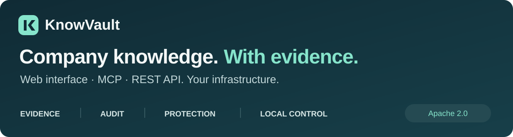
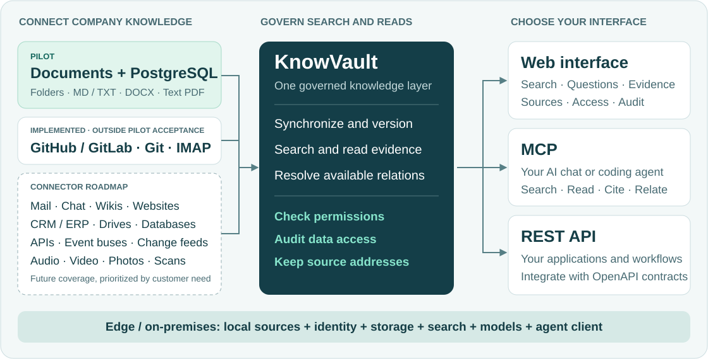
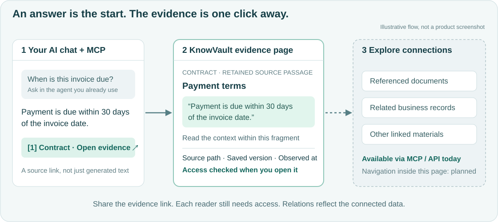

  

  Company knowledge through a web interface, MCP and REST API. 
  Ask in your AI chat. Open the evidence in KnowVault. Trace the source.

  <a href="docs/GETTING_STARTED.md">Start a pilot</a> ·
  <a href="docs/MCP_ACCESS_CODE.md">Connect your agent</a> ·
  <a href="#connectors">Connectors</a> ·
  <a href="docs/PILOT-STATUS.md">Release status</a> ·
  <a href="LICENSE">Apache 2.0</a>

## Evidence. Audit. Protection. Local control.

KnowVault connects employees, AI agents and applications to permitted company knowledge. Its connector roadmap spans files, Git, email, messaging, wikis, business systems, databases, event streams, audio and images.

| Three ways in | What you can do |
| --- | --- |
| **[Web interface](docs/GETTING_STARTED.md)** | Search, ask a question, open evidence, manage sources and inspect access. |
| **[MCP](docs/MCP_ACCESS_CODE.md)** | Give your existing AI chat or coding agent tools to search, read, cite and follow available relations. |
| **[REST API](api/openapi.yaml)** | Integrate search, source reads and evidence relations into your own application or workflow. |

| What matters | What KnowVault provides |
| --- | --- |
| **Evidence you can open** | Exact passages, saved source versions, timestamps and fragment hashes. Follow a citation and inspect the underlying document or SQL record. |
| **Access you can audit** | Data reads and administrative actions attributed to users or service identities, with a searchable audit journal. |
| **Protected company data** | SSO through Keycloak/OIDC, workspace permissions, revocable agent credentials and authorization checks when evidence is read. |
| **Cloud-free operation** | Run ingestion, storage, search, identity and model inference on your infrastructure, using local models and a local AI client. |

## One knowledge layer. Many sources. Three ways to use it.

**Edge / on-premises:** configure local embeddings, a local LLM and a local client to keep the knowledge workflow inside your network. Built-in cloud model profiles are optional and controlled per workspace. Air-gapped installation packaging and hardware sizing remain subject to [pilot qualification](docs/PILOT-STATUS.md).

## From an AI answer to the evidence

**Click a citation in your chat and enter KnowVault.** Your agent includes the returned evidence-page link in its answer. The page shows the retained passage, context within that fragment, source location, saved version and provenance. Share the link with a colleague; their own permissions determine what they can open.

**Follow the connections:** MCP and REST API expose the available stored relations between addressed materials. Bringing those related-document links into the evidence page is the next UI step; it is not shown there today.

## Connectors

**A broad connector roadmap, not just a document folder.** Bring documents, business records and team knowledge into the same evidence workflow.

| Availability | Sources |
| --- | --- |
| **Available in the pilot** | Server folders: Markdown, plain text, supported DOCX and text-based PDF. Prepared PostgreSQL views: versioned entity snapshots with typed values and provenance. |
| **Implemented; outside pilot acceptance** | GitHub/GitLab APIs, mounted Git checkouts, and read-only IMAP email with attachments. Git checkout refresh is operator-managed. |

**The roadmap: company knowledge in every form.**

- **Code, mail and conversations:** Git platforms, Exchange/Gmail, Slack, Teams, Telegram and enterprise messengers.
- **Documents and shared knowledge:** SharePoint, Google Drive, network shares, Confluence, Notion, websites and intranets.
- **Business systems:** CRM, ERP, service desks, project trackers, SQL/NoSQL databases and data warehouses.
- **Storage and integrations:** S3-compatible stores, REST/GraphQL APIs, webhooks and scheduled exports.
- **Data in motion:** Kafka, RabbitMQ, NATS, MQTT, enterprise integration buses and database change streams.
- **Audio and visual knowledge:** recordings, meeting transcripts, video, photos, screenshots, scans and OCR/VLM document extraction.

Explore the [connector and format roadmap](docs/CONNECTOR-ROADMAP.md) for platform examples and intended coverage. These are development directions; delivery order follows customer priorities. The pilot remains folders and prepared PostgreSQL views.

## Connect your agent

Connect your client to `https://<your-knowvault-host>/api/v1/mcp` using **Streamable HTTP** and `Authorization: Bearer <access-code>`. A workspace owner issues the code in **Access**; store it in your client's private configuration.

[MCP setup](docs/MCP_ACCESS_CODE.md) · [Search and read tools](docs/MCP-TOOLS.md) · [SQL snapshot contract](docs/SQL-SNAPSHOTS.md)

## Pilot status

**Operator-assisted MCP pilot.** Built-in model answers are preliminary; a valid citation does not establish answer completeness. OCR, Excel analysis, arbitrary SQL analytics and a qualified offline installation bundle are outside this release guarantee. [Measured results and limits](docs/PILOT-STATUS.md).

**Stack:** Go · PostgreSQL · OpenSearch · Keycloak · React / TypeScript.

[Documentation](docs/README.md) · [Contributing](CONTRIBUTING.md) · [Testing](docs/TESTING.md) · [Report an issue](https://github.com/avangerus/knowvault/issues/new/choose) · [Security](SECURITY.md)

Licensed under [Apache-2.0](LICENSE). Third-party components and model artifacts retain their [own licenses](architecture/licenses.yaml).
