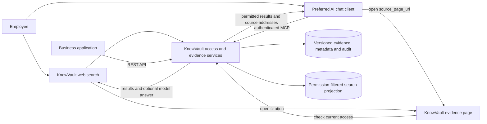
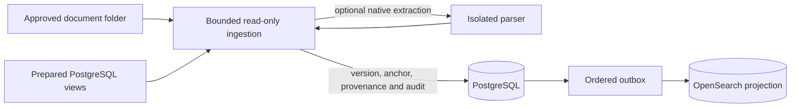

# HLD — system design

KnowVault is an enterprise knowledge service for employees, AI agents and
applications. It retrieves permitted company data and returns inspectable,
versioned evidence with access attribution. The current release is an
[MCP pilot with a web application and REST API](PILOT-STATUS.md).

This is the component and data-flow overview. [Architecture](../ARCHITECTURE.md)
owns the technical invariants; [LLD](LLD.md) maps them to code. Detailed schemas,
security rules and accepted decisions are linked from the
[documentation map](README.md#source-of-truth-hierarchy).

## 1. From a question to evidence

An external AI client receives tool results and performs its own reasoning.
KnowVault does not replace that client's conversation interface. Its own web
application uses independent search questions and optional model answers.

The returned `source_page_url` opens a separate page inside the KnowVault
deployment, with the retained passage, version and source metadata. Opening it
requires current authorization; a copied link does not grant access. The retained
extraction is distinct from the original file. Original-source locators may
require separate upstream access.

Read tools provide surrounding fragments and recorded relationships where
available. These are evidence-backed navigation primitives, not a claim of a
complete inferred company graph or a universal relationship browser. See the
[MCP tools](MCP-TOOLS.md) and [client guide](MCP-CLIENT-GUIDE.md).

## 2. Components

| Boundary | Responsibility |
| --- | --- |
| Server | Static web UI, OIDC/session handling, REST/MCP, authorization, search, evidence pages, source management and audit journal. |
| Worker | Durable source synchronization, extraction, indexing and maintenance jobs; read-only source adapters. |
| PostgreSQL | Authoritative tenant/workspace state, encrypted derived artifacts, versions, audit, jobs and outbox. |
| OpenSearch | Rebuildable lexical/vector search projection; it never grants access by itself. |
| Model adapters | Profile-bound embeddings and optional built-in answers. External MCP clients use their own models. |
| Native parser deployment | Optional dispatcher, host supervisor and isolated Apache POI/PDFBox processes for supported Office/text-PDF extraction. |
| Operator / purger | Separately configured administration and retention capabilities. |

The standalone connector executable is still a scaffold. Current source adapters
run through the application worker; a working adapter does not imply a separately
deployable remote connector agent.

## 3. Source data to a retained snapshot

An operator defines the source connection, scope and trust configuration. An
authorized owner activates the source; a durable job carries its exact revision
and lease identity. The worker validates those coordinates before publishing
immutable versions, extractions and evidence fragments. Index changes follow the
authoritative transaction and are checked again at read time.

The pilot covers mounted folders and prepared PostgreSQL views, including
supported DOCX and text-PDF when the native profile is provisioned. SQL business
entities become typed, versioned snapshots; the prepared-view adapter accepts
structured configuration rather than arbitrary SQL text. See
[SQL snapshots](SQL-SNAPSHOTS.md) and [Native ingestion](NATIVE-INGEST.md).

Scheduled refresh, visible skips, freshness and observed disappearance/return
are part of the source lifecycle. Retention purge is a separate privileged,
irreversible process. A source error, missing source or partial result must not
be represented as proof that no relevant data exists.

Git and IMAP implementations extend the codebase beyond the qualified pilot.
Future business-system connectors, media processing and broader relationship
coverage are described in the [connector roadmap](CONNECTOR-ROADMAP.md).

## 4. Authorization and audit

Every request establishes a trusted user or service identity and organization.
Workspace membership, source bindings and the applicable source-access mode
constrain the operation. `WORKSPACE_MANAGED` is an explicit grant over derived
data; it is not automatic inheritance of upstream permissions. `SOURCE_ENFORCED`
requires the corresponding identity and source-ACL guarantees.

PostgreSQL row-level security and composite identities protect authoritative
state. Search filters reduce candidates, then current database authorization is
rechecked before disclosure. Historical addresses and saved answers retain
provenance, not historical permission to read.

Audit records administrative actions and data-access attribution using bounded
metadata, without becoming a copy of source text or prompts. Hash chains and
checkpoint contracts provide integrity evidence; deployment of an external
append-only checkpoint sink is a separate operational requirement.

Details: [Trust boundary](TRUST_BOUNDARY.md), [Encryption](ENCRYPTION.md),
[Data model](DATA_MODEL.md) and [Safety invariants](../POKA_YOKE.md).

## 5. Model and deployment choices

Search and evidence reading do not require built-in generation. When enabled,
the user selects a model profile available to that workspace. Unknown or forbidden
profiles fail before a provider call; no hidden fallback chooses a different
model. The current adapter is preliminary and does not establish the complete
production qualification defined by the model-runtime architecture.

A cloud-free runtime uses local sources, identity, embeddings, answer models and
agent clients. Approved external profiles or cloud-backed sources remain explicit
operator choices. KnowVault cannot enforce the model or data policy of a separate
AI client after that client receives authorized results.

The base Compose stack and native-ingestion overlay have different prerequisites.
Native parsing needs the configured Linux supervisor and dispatcher; it has no
in-process fallback. Images and model artifacts must be pre-staged for offline
installation. The development bootstrap downloads dependencies, and the pilot
does not claim a turnkey offline installer or complete host-reboot qualification.

See [Deployment](DEPLOYMENT.md), [Model profiles](MODEL-PROFILES.md) and
[Compose](../deploy/compose/README.md). Evaluate observable behavior using
[Pilot acceptance](PILOT-ACCEPTANCE.md); code or design availability alone does
not establish retrieval quality, answer completeness or company-wide scale.
