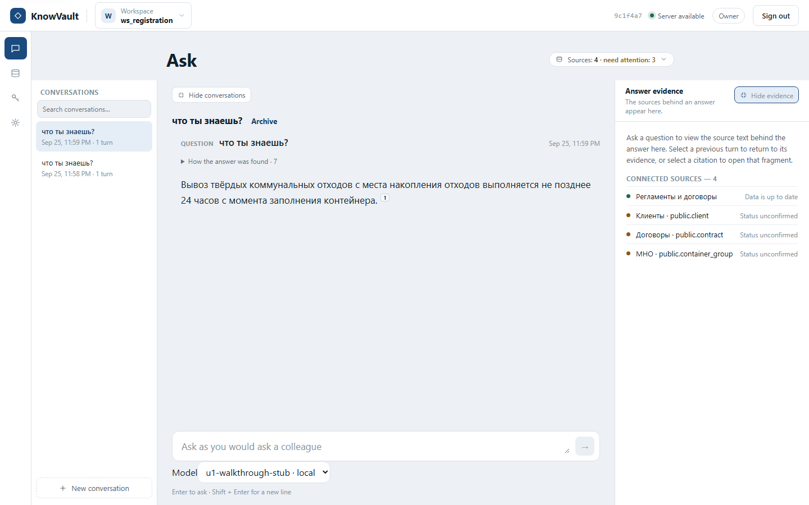
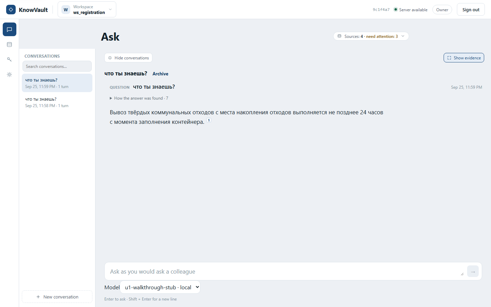
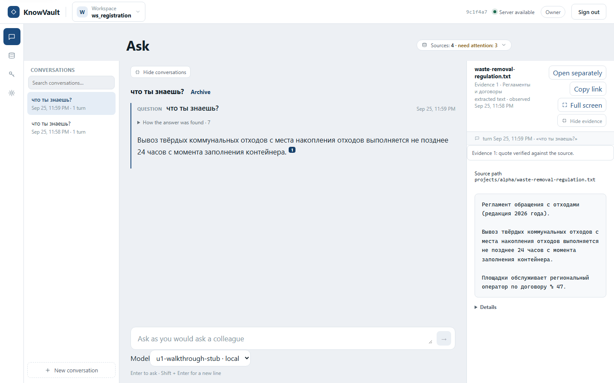
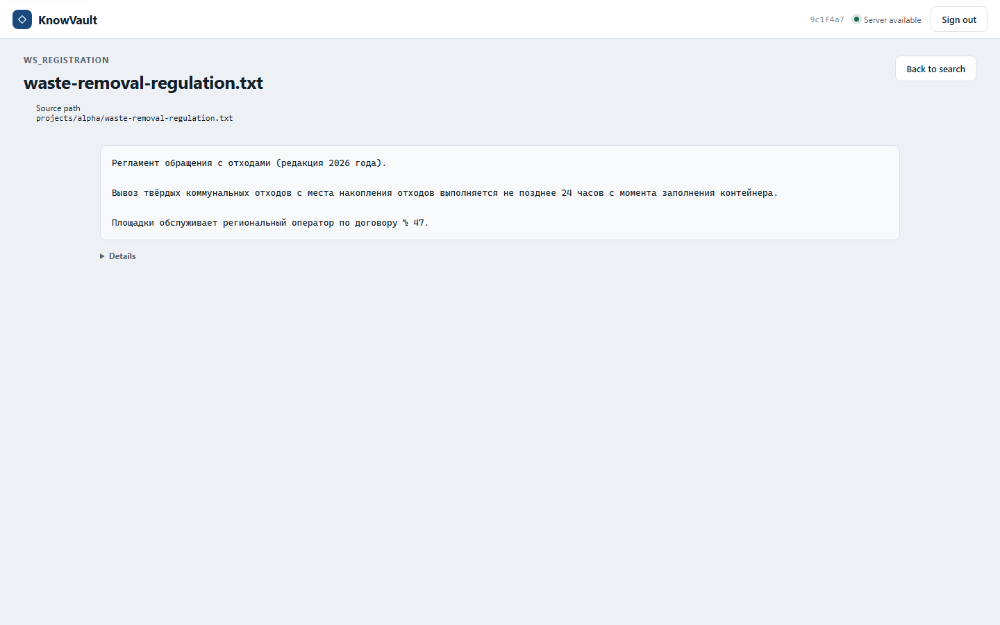

# Walkthrough report

A robot walked the real web interface of the local synthetic stand.

- Command: `bash tests/e2e/walkthrough/run-walkthrough.sh`
- Scenario: local
- Stand: https://127.0.0.1:55476
- Started: 2026-09-25T20:58:55.226Z
- Finished: 2026-09-25T20:59:57.923Z
- Total: 62.697 s
- Result: **PASS** (11 steps, 0 failed)

## Screen comparison (enforce)

- Approved references: `tests/e2e/walkthrough/references/local`
- Steps compared: 11
- Steps with a differing screen: 0
- Steps failed on the comparison: 0
- Steps without an approved reference: 0
- Largest difference: 0.035% (threshold 0.050%, per-pixel tolerance 16)

## Interface review (vision model)

- Model: `deepseek-flash` at `https://api.deepseek.com`
- Rules: `docs/UI-PRINCIPLES.md` (15 rules)
- Screens reviewed: 11 (0 not reviewed)
- Screens with no remarks: 0
- Remarks: 81
- Review cost: $0.0050 (ceiling $0.0500, off_peak prices)

### 1. the interface shows the running server revision

Remarks (2):

- **Rule 5** (Не больше 7 элементов управления в одной группе) — верхний правый угол шапки: Рядом с кнопкой «Sign in» стоит технический код «9c1f4a7» — это отдельный элемент управления/служебный текст в одной группе с кнопкой входа.
- **Rule 3** (Служебное — по запросу) — верхний правый угол шапки: Хеш/идентификатор «9c1f4a7» показан на первом экране; такие технические данные должны быть скрыты за «Подробнее».

### 2. sign in as the test user

Remarks (10):

- **Rule 3** (Служебное — по запросу) — шапка страницы, справа — рядом с «Server available»: Технический идентификатор «9c1f4a7» (хеш/ID) показан на первом экране; его нужно убрать за «Подробнее».
- **Rule 3** (Служебное — по запросу) — левый нижний угол — подпись «Model»: Техническое имя модели «u1-walkthrough-stub · local» (stub, local) выставлено на первый экран вместо человеческого названия.
- **Rule 3** (Служебное — по запросу) — левая панель, под «Search conversations…»: В списке беседы видно «Sep 25, 11:58 PM · 1 turn» — служебные метаданные (turn) на первом экране.
- **Rule 5** (Не больше 7 элементов управления в одной группе) — нижняя область ввода, под полем вопроса: Под полем ввода сгруппированы поле, селектор модели, подсказка «Enter to ask · Shift + Enter for a new line» и круглая кнопка отправки — группа перегружена, часть служебного стоит спрятать.
- **Rule 6** (Слова человека, не системы) — шапка страницы, справа — «Server available»: Системное сообщение на английском; нужна человеческая формулировка на русском.
- **Rule 6** (Слова человека, не системы) — левый нижний угол, подпись «Model»: Технический слаг «u1-walkthrough-stub · local» вместо понятного названия модели.
- **Rule 6** (Слова человека, не системы) — правая часть шапки панели — «Sources: 4 · need attention: 3»: Подпись на английском и в служебной форме, вместо «Источник обновлён…» по-русски.
- **Rule 6** (Слова человека, не системы) — нижняя область ввода: Подсказка «Enter to ask · Shift + Enter for a new line» дана на английском, а не на языке пользователя.
- **Rule 9** (Видно, где я и что за версия) — верхняя часть экрана, заголовок страницы: Заголовок «Ask» не отражает рабочее пространство «ws_registration»; версия продукта нигде не показана.
- **Rule 11** (Сетка и выравнивание) — центральная область и правая часть: Кнопка «Sources: 4 · need attention: 3» стоит на другой вертикали, чем «Show evidence», — края и отступы не сходятся по общей сетке.

### 3. open Sources and confirm the synthetic database tables

Remarks (7):

- **Rule 6** (Слова человека, не системы) — карточки источников «Клиенты» и «Договоры», строки состояния: Технические англоязычные подписи вместо человеческих: «Status unconfirmed», «Freshness: unknown», «SQL not configured», «Document folder», «Latest run · completed», «1 table · 0 indexed», «Query credential reference», «cred_…», «Discovered/Processed/New versions/Fragments published/Quarantined» — интерфейс не по-русски и не по делу.
- **Rule 3** (Служебное — по запросу) — верхняя панель, центр и справа: Технические детали на первом экране: «9c1f4a7 Server available», «model: on premises», «Query credential reference» с полем cred_… — должны быть за «Подробнее».
- **Rule 2** (Ничего дважды) — карточки «Клиенты» и «Договоры»: Две одинаковые карточки с одинаковым набором элементов (счётчики, поле cred_…, кнопка Save, «Tables (1)») и одинаковым статусом — дублирование одного и того же блока действий.
- **Rule 9** (Видно, где я и что за версия) — шапка страницы, слева: Виден workspace «WS_REGISTRATION», но нет названия экрана вместе с номером версии — номер версии нигде не отображается.
- **Rule 13** (Спокойная палитра) — карточка «Регламенты и договоры», бейдж статуса: Бейдж «Data is up to date» выполнен зелёным — зелёный использован как второй акцент рядом с основным синим, что размывает единственный акцентный цвет.
- **Rule 12** (Читаемый размер) — нижние карточки источников, поля и кнопки: Поле «cred_…» и кнопки «Save» выглядят ниже 36 px по высоте (порядка 28–32 px) при масштабе 1:1.
- **Rule 11** (Сетка и выравнивание) — карточки источников, правый край: Кнопка «Refresh» и ссылка «Disable» в первой карточке смещены вправо относительно кнопки «Connect source», левые края карточек не совпадают с блоком заголовка «Sources 4».

### 4. open the model settings and save a change

Remarks (6):

- **Rule 2** (Ничего дважды) — основная область: «Save all» справа и «Save» под полем описания: Две кнопки сохранения на одном экране — неясно, чем они отличаются; одно действие должно быть представлено одним элементом.
- **Rule 9** (Видно, где я и что за версия) — шапка страницы и заголовок блока: Название экрана и версия показаны только по-английски («Settings», «MODEL CONTEXT», «Version 2 · usr_reg_owner»), хотя интерфейс должен быть на русском.
- **Rule 3** (Служебное — по запросу) — верхняя панель справа и строка «Version 2 · usr_reg_owner»: Технические данные (хеш 9c1f4a7, id воркспейса ws_registration, usr_reg_owner, «model: on premises») выставлены на первом плане вместо «Подробнее».
- **Rule 6** (Слова человека, не системы) — весь экран: Подписи и названия вкладок даны по-английски и техническими терминами («MODEL CONTEXT», «Proposals (0)», «stale»-подобные id) вместо понятных русских формулировок.
- **Rule 12** (Читаемый размер) — верхняя панель: хеш, «Server available», «Owner»: Вспомогательный текст в шапке заметно мельче основного (порядка 11–12 px при 14 px основного), что ниже читаемого минимума.
- **Rule 14** (Формы как документ, а не как анкета) — блок «Description» под вкладками: Одиночное большое поле без пояснения под ним; вкладки «Instructions / Glossary / Sources» выглядят как анкета, а не как связный документ настроек.

### 5. ask the question in the chat and get an answer

Remarks (3):

- **Rule 3** (Служебное — по запросу) — шапка страницы, вверху справа: Показаны технические данные: идентификатор воркспейса «9c1f4a7», состояние «Server available» и внутренний идентификатор модели «u1-walkthrough-stub · local» внизу у поля ввода — это техника на первом экране, её нужно убрать за «Подробнее».
- **Rule 6** (Слова человека, не системы) — панель над полем ответа и подпись у поля ввода: Подписи на английском и в системных терминах: «Sources: 4 · need attention: 3», «Hide conversations», «Show evidence», «Archive», а также «Model», «Enter to ask · Shift + Enter for a new line» вместо понятных русских формулировок.
- **Rule 9** (Видно, где я и что за версия) — заголовок страницы и шапка: Название экрана «Ask» не по-русски, а номер версии/сборки продукта нигде не виден.

### 6. collapse the conversation list

Remarks (6):

- **Rule 6** (Слова человека, не системы) — нижний левый угол панели, подписи кнопок: Интерфейсные подписи на английском: «Show conversations», «Show evidence», «Archive», «Ask as you would ask a colleague», «Sign out», «Model», «Server available», «Owner», «Enter to ask» — должны быть на русском.
- **Rule 3** (Служебное — по запросу) — шапка страницы, справа: Видны технические данные: «9c1f4a7» и «Server available» — это служебная информация, ей место за «Подробнее».
- **Rule 2** (Ничего дважды) — верхняя часть страницы и низ панели: Призыв «ЧТО ТЫ ЗНАЕШЬ?» дублируется: и как заголовок, и как метка «QUESTION» над ответом.
- **Rule 9** (Видно, где я и что за версия) — шапка страницы, по центру: Нет номера версии документа/ответа в постоянном виде — видно только дату «Sep 25, 11:59 PM» без версии.
- **Rule 13** (Спокойная палитра) — левая вертикальная панель, верхняя иконка: Активная иконка залита плотным тёмно-синим — это второй сильный акцент помимо главной кнопки отправки; ослабьте до нейтрального состояния.
- **Rule 15** (Ничего не обрезано и не наезжает) — нижний левый угол, подпись «Model» с выпадающим списком: Строка «Model u1-walkthrough-stub · local» упирается в нижнюю кромку и почти соприкасается с подсказкой «Enter to ask» — тесно на границе окна.

### 7. expand the conversation list again

Remarks (13):

- **Rule 3** (Служебное — по запросу) — шапка страницы, справа вверху: Технический идентификатор «9c1f4a7» и служебный статус «Server available» показаны на первом экране, хотя это техника.
- **Rule 3** (Служебное — по запросу) — под полем вопроса, слева: Идентификатор модели «u1-walkthrough-stub · local» выведен на первом экране как техническая строка.
- **Rule 3** (Служебное — по запросу) — поле Workspace, вверху слева: Служебное имя рабочего пространства «ws_registration» показано в шапке.
- **Rule 6** (Слова человека, не системы) — шапка страницы, справа вверху: Подпись «Server available» и «9c1f4a7» — системная техническая формулировка вместо человеческой.
- **Rule 6** (Слова человека, не системы) — под полем вопроса, слева: Название модели «u1-walkthrough-stub · local» — нечеловеческая системная строка.
- **Rule 6** (Слова человека, не системы) — кнопка под заголовком вопроса, справа вверху: Подпись «Sources: 4 · need attention: 3» на английском и с технической формулировкой.
- **Rule 6** (Слова человека, не системы) — панель чатов слева: Подписи интерфейса на английском: CONVERSATIONS, Search conversations, Hide conversations, Show evidence, Archive, QUESTION, New conversation.
- **Rule 9** (Видно, где я и что за версия) — шапка страницы, вверху слева: Не видно названия экрана и номера версии — есть только логотип и имя рабочего пространства.
- **Rule 12** (Читаемый размер) — нижний левый угол панели чатов: Кнопка «+ New conversation» по высоте около 32 px — ниже требуемых 36 px.
- **Rule 12** (Читаемый размер) — панель чатов слева, поле поиска: Поле «Search conversations» по высоте около 32 px — ниже требуемых 36 px.
- **Rule 12** (Читаемый размер) — шапка страницы, справа вверху: Небольшие служебные подписи «9c1f4a7» и «Server available» набраны мелким шрифтом меньше 14 px.
- **Rule 15** (Ничего не обрезано и не наезжает) — шапка страницы, вверху слева: Название рабочего пространства «ws_registration» и «Workspace» прижаты к краю и рискуют обрезаться при меньшей ширине окна.
- **Rule 1** (Одна главная задача на экран) — весь экран: На экране одновременно видны и список чатов, и лента вопроса, и панель с кнопками источников и доказательств — главное действие не выделено однозначно.

### 8. open the evidence panel with the screen control

Remarks (7):

- **Rule 6** (Слова человека, не системы) — шапка страницы, справа вверху: Показаны технические идентификаторы «9c1f4a7» и статус «Server available» — системный жаргон на первом экране.
- **Rule 3** (Служебное — по запросу) — правая панель, список CONNECTED SOURCES: Видны технические имена вида «Клиенты · public.client», «Договоры · public.contract», «МНО · public.container_group» — схемы и таблицы данных вместо человеческих названий.
- **Rule 6** (Слова человека, не системы) — правая панель, статусы источников: Статусы «Data is up to date» и «Status unconfirmed» — английский и системный текст вместо человеческих формулировок на русском.
- **Rule 13** (Спокойная палитра) — правая панель, точки слева от источников: Оранжевые/янтарные индикаторы статуса выглядят как предупреждение, хотя непонятно, есть ли ошибка; акцент размывается.
- **Rule 2** (Ничего дважды) — левая панель и основная область: В списке чатов и в блоке вопроса дублируются «что ты знаешь?» — один и тот же текст в двух местах без различия ролей.
- **Rule 9** (Видно, где я и что за версия) — основная область, заголовок: Заголовок экрана «Ask» без номера версии/сборки продукта; версия нигде не видна.
- **Rule 15** (Ничего не обрезано и не наезжает) — нижняя часть основной области, блок Model: Селект «u1-walkthrough-stub · local» с длинным техническим значением при 1280–1366 px рискует обрезаться и наезжать на поле ввода.

### 9. close the evidence panel with one action

Remarks (7):

- **Rule 3** (Служебное — по запросу) — верхняя шапка, под названием воркспейса: Технический идентификатор «9c1f4a7» показан на первом экране без «Подробнее».
- **Rule 3** (Служебное — по запросу) — под полем вопроса, слева: Идентификатор модели «u1-walkthrough-stub · local» — техника на первом экране.
- **Rule 3** (Служебное — по запросу) — строка вопроса, справа вверху: Метка «QUESTION Что ты знаешь?» и служебное «How the answer was found · 7» занимают первый экран служебной информацией.
- **Rule 6** (Слова человека, не системы) — под полем вопроса и в шапке: Английские подписи: «Ask as you would ask a colleague», «Hide conversations», «Show evidence», «Server available», «Ask», «Sources». Интерфейс заявлен по-русски.
- **Rule 6** (Слова человека, не системы) — строка под вопросом: Формулировка «How the answer was found · 7» — машинный текст вместо понятной подписи.
- **Rule 12** (Читаемый размер) — текст ответа и подписи: Текст ответа и мелкие подписи выглядят мельче 14 px — основной текст должен быть не меньше 14 px.
- **Rule 15** (Ничего не обрезано и не наезжает) — шапка страницы, справа: Плашка «Sources · 4 · need attention: 3» и строка идентификатора находятся у самого края и могут обрезаться при ширине 1280–1366 px.

### 10. open the evidence of that answer

Remarks (10):

- **Rule 6** (Слова человека, не системы) — верхняя панель справа; карточка доказательства справа: Технические строки на английском и системные идентификаторы: «Server available», «Owner», «ws_registration», «Evidence 1», «extracted text · observed», «Source path projects/alpha/waste-removal-regulation.txt», «turn Sep 25, 11:59 PM».
- **Rule 6** (Слова человека, не системы) — кнопки на панели доказательства справа: Подписи действий на английском: «Open separately», «Copy link», «Full screen», «Hide evidence».
- **Rule 3** (Служебное — по запросу) — панель доказательства справа, блок «Source path»: Путь к файлу и внутренний идентификатор проекта показаны на первом экране, а не спрятаны за «Подробнее».
- **Rule 3** (Служебное — по запросу) — верхняя панель, рядом с «Workspace»: Технический код «9c1f4a7» виден без раскрытия.
- **Rule 9** (Видно, где я и что за версия) — заголовок чата над полем ввода: Название экрана и номер версии ответа нигде явно не показаны — «Ask» в шапке не описывает текущий экран, номер версии отсутствует.
- **Rule 8** (Текст свёрстан) — блок ответа в чате и карточка доказательства: Текст показан сплошной строкой без структуры заголовков и списков.
- **Rule 12** (Читаемый размер) — левая панель «CONVERSATIONS» и второстепенные подписи: Служебные подписи заметно мельче 14 px — ниже минимального читаемого размера.
- **Rule 13** (Спокойная палитра) — иконка citation 1 в ответе и активный пункт чата слева: Синий акцент используется в нескольких разных местах (иконка цитаты, активный чат, фокус поля), из-за чего неясно, какое действие главное.
- **Rule 1** (Одна главная задача на экран) — правый верхний угол и панель доказательства: Одновременно показаны чат, список доказательства и служебные панели; главное действие (задать вопрос) не выделено среди второстепенных.
- **Rule 15** (Ничего не обрезано и не наезжает) — нижняя часть панели доказательства и правая колонка при 1280–1366 px: Правая колонка с доказательством занимает почти треть ширины поверх контента; при сужении окна текст ответа и панели будут сжаты и вероятно обрезаны.

### 11. open the source page of that answer

Remarks (10):

- **Rule 3** (Служебное — по запросу) — шапка, слева под заголовком («Source path projects/alpha/waste-removal-regulation.txt») и шапка справа (хеш «9c1f4a7»): Путь к файлу и хеш/идентификатор вынесены на первый экран; техническую информацию следует спрятать под «Подробнее».
- **Rule 3** (Служебное — по запросу) — верхний левый угол над заголовком («WS_REGISTRATION»): Технический код раздела показан как основной заголовок; пользователю нужнее человеческое название страницы.
- **Rule 6** (Слова человека, не системы) — шапка страницы и верхний левый угол: Английские системные подписи «WS_REGISTRATION», «Source path», «Server available», «Sign out», «Back to search» вместо русского интерфейса.
- **Rule 9** (Видно, где я и что за версия) — верхняя часть страницы, заголовок: Нет явного названия экрана и номера версии документа; «редакция 2026 года» указана в тексте, но не в шапке.
- **Rule 1** (Одна главная задача на экран) — весь экран: Непонятно главное действие: функций кроме чтения и ухода назад нет, экран выглядит как тупик без понятного следующего шага.
- **Rule 4** (Вспомогательные панели убираются) — под блоком текста, слева («▸ Details»): Скрытый блок «Details» дублирует уже показанный путь и данные; назначение панели из подписи неясно.
- **Rule 14** (Формы как документ, а не как анкета) — центральная область с текстом: Текст документа завёрнут в узкий блок с рамкой шириной около половины экрана вместо колонки во всю ширину.
- **Rule 11** (Сетка и выравнивание) — заголовок и путь слева против кнопки «Back to search» справа: Левый край заголовка и поля «Source path», а также отступы слева от блока текста не совпадают — единая сетка не выдержана.
- **Rule 15** (Ничего не обрезано и не наезжает) — блок с текстом документа: Контент занимает малую часть ширины окна 1440 px, справа остаётся большое пустое поле; при 1280–1366 px остаются крупные незаполненные области.
- **Rule 12** (Читаемый размер) — текст документа и ссылка «Details»: Вспомогательные подписи («Source path», «Details», верхняя строка) выглядят мельче 14 px и хуже читаются, чем нужно.

## Answers (1)

### что ты знаешь?

Вывоз твёрдых коммунальных отходов с места накопления отходов выполняется не позднее 24 часов с момента заполнения контейнера.

## Steps

### 1. the interface shows the running server revision — passed (0.11 s)

Screen comparison: **same** — 0.000% of the screen differs (threshold 0.050%)

Approved reference: `tests/e2e/walkthrough/references/local/01-the-interface-shows-the-running-server-revision.png`

Interface review: 2 remarks ($0.0001)
- **Rule 5** (Не больше 7 элементов управления в одной группе) — верхний правый угол шапки: Рядом с кнопкой «Sign in» стоит технический код «9c1f4a7» — это отдельный элемент управления/служебный текст в одной группе с кнопкой входа.
- **Rule 3** (Служебное — по запросу) — верхний правый угол шапки: Хеш/идентификатор «9c1f4a7» показан на первом экране; такие технические данные должны быть скрыты за «Подробнее».

Mutating requests (0):

- none

HTTP responses >= 500 (0):

- none

Browser console errors (1):

- Failed to load resource: the server responded with a status of 401 (Unauthorized)

HTTP responses 400-499 (1):

- GET /api/v1/workspaces -> 401 (UNAUTHENTICATED)

### 2. sign in as the test user — passed (0.12 s)

Screen comparison: **same** — 0.007% of the screen differs (threshold 0.050%)

Approved reference: `tests/e2e/walkthrough/references/local/02-sign-in-as-the-test-user.png`

Interface review: 10 remarks ($0.0006)
- **Rule 3** (Служебное — по запросу) — шапка страницы, справа — рядом с «Server available»: Технический идентификатор «9c1f4a7» (хеш/ID) показан на первом экране; его нужно убрать за «Подробнее».
- **Rule 3** (Служебное — по запросу) — левый нижний угол — подпись «Model»: Техническое имя модели «u1-walkthrough-stub · local» (stub, local) выставлено на первый экран вместо человеческого названия.
- **Rule 3** (Служебное — по запросу) — левая панель, под «Search conversations…»: В списке беседы видно «Sep 25, 11:58 PM · 1 turn» — служебные метаданные (turn) на первом экране.
- **Rule 5** (Не больше 7 элементов управления в одной группе) — нижняя область ввода, под полем вопроса: Под полем ввода сгруппированы поле, селектор модели, подсказка «Enter to ask · Shift + Enter for a new line» и круглая кнопка отправки — группа перегружена, часть служебного стоит спрятать.
- **Rule 6** (Слова человека, не системы) — шапка страницы, справа — «Server available»: Системное сообщение на английском; нужна человеческая формулировка на русском.
- **Rule 6** (Слова человека, не системы) — левый нижний угол, подпись «Model»: Технический слаг «u1-walkthrough-stub · local» вместо понятного названия модели.
- **Rule 6** (Слова человека, не системы) — правая часть шапки панели — «Sources: 4 · need attention: 3»: Подпись на английском и в служебной форме, вместо «Источник обновлён…» по-русски.
- **Rule 6** (Слова человека, не системы) — нижняя область ввода: Подсказка «Enter to ask · Shift + Enter for a new line» дана на английском, а не на языке пользователя.
- **Rule 9** (Видно, где я и что за версия) — верхняя часть экрана, заголовок страницы: Заголовок «Ask» не отражает рабочее пространство «ws_registration»; версия продукта нигде не показана.
- **Rule 11** (Сетка и выравнивание) — центральная область и правая часть: Кнопка «Sources: 4 · need attention: 3» стоит на другой вертикали, чем «Show evidence», — края и отступы не сходятся по общей сетке.

Mutating requests (0):

- none

HTTP responses >= 500 (0):

- none

Browser console errors (1):

- Failed to load resource: the server responded with a status of 401 (Unauthorized)

HTTP responses 400-499 (1):

- GET /api/v1/workspaces -> 401 (UNAUTHENTICATED)

### 3. open Sources and confirm the synthetic database tables — passed (1.09 s)

Screen comparison: **same** — 0.022% of the screen differs (threshold 0.050%)

Approved reference: `tests/e2e/walkthrough/references/local/03-open-sources-and-confirm-the-synthetic-database-tables.png`

Interface review: 7 remarks ($0.0005)
- **Rule 6** (Слова человека, не системы) — карточки источников «Клиенты» и «Договоры», строки состояния: Технические англоязычные подписи вместо человеческих: «Status unconfirmed», «Freshness: unknown», «SQL not configured», «Document folder», «Latest run · completed», «1 table · 0 indexed», «Query credential reference», «cred_…», «Discovered/Processed/New versions/Fragments published/Quarantined» — интерфейс не по-русски и не по делу.
- **Rule 3** (Служебное — по запросу) — верхняя панель, центр и справа: Технические детали на первом экране: «9c1f4a7 Server available», «model: on premises», «Query credential reference» с полем cred_… — должны быть за «Подробнее».
- **Rule 2** (Ничего дважды) — карточки «Клиенты» и «Договоры»: Две одинаковые карточки с одинаковым набором элементов (счётчики, поле cred_…, кнопка Save, «Tables (1)») и одинаковым статусом — дублирование одного и того же блока действий.
- **Rule 9** (Видно, где я и что за версия) — шапка страницы, слева: Виден workspace «WS_REGISTRATION», но нет названия экрана вместе с номером версии — номер версии нигде не отображается.
- **Rule 13** (Спокойная палитра) — карточка «Регламенты и договоры», бейдж статуса: Бейдж «Data is up to date» выполнен зелёным — зелёный использован как второй акцент рядом с основным синим, что размывает единственный акцентный цвет.
- **Rule 12** (Читаемый размер) — нижние карточки источников, поля и кнопки: Поле «cred_…» и кнопки «Save» выглядят ниже 36 px по высоте (порядка 28–32 px) при масштабе 1:1.
- **Rule 11** (Сетка и выравнивание) — карточки источников, правый край: Кнопка «Refresh» и ссылка «Disable» в первой карточке смещены вправо относительно кнопки «Connect source», левые края карточек не совпадают с блоком заголовка «Sources 4».

Mutating requests (3):

- POST /api/v1/workspaces/ws_registration/managed-source-confirmations:batch
- POST /api/v1/workspaces/ws_registration/managed-source-confirmations:batch
- POST /api/v1/workspaces/ws_registration/managed-source-confirmations:batch

HTTP responses >= 500 (0):

- none

Browser console errors (0):

- none

### 4. open the model settings and save a change — passed (0.20 s)

Screen comparison: **same** — 0.000% of the screen differs (threshold 0.050%)

Approved reference: `tests/e2e/walkthrough/references/local/04-open-the-model-settings-and-save-a-change.png`

Interface review: 6 remarks ($0.0005)
- **Rule 2** (Ничего дважды) — основная область: «Save all» справа и «Save» под полем описания: Две кнопки сохранения на одном экране — неясно, чем они отличаются; одно действие должно быть представлено одним элементом.
- **Rule 9** (Видно, где я и что за версия) — шапка страницы и заголовок блока: Название экрана и версия показаны только по-английски («Settings», «MODEL CONTEXT», «Version 2 · usr_reg_owner»), хотя интерфейс должен быть на русском.
- **Rule 3** (Служебное — по запросу) — верхняя панель справа и строка «Version 2 · usr_reg_owner»: Технические данные (хеш 9c1f4a7, id воркспейса ws_registration, usr_reg_owner, «model: on premises») выставлены на первом плане вместо «Подробнее».
- **Rule 6** (Слова человека, не системы) — весь экран: Подписи и названия вкладок даны по-английски и техническими терминами («MODEL CONTEXT», «Proposals (0)», «stale»-подобные id) вместо понятных русских формулировок.
- **Rule 12** (Читаемый размер) — верхняя панель: хеш, «Server available», «Owner»: Вспомогательный текст в шапке заметно мельче основного (порядка 11–12 px при 14 px основного), что ниже читаемого минимума.
- **Rule 14** (Формы как документ, а не как анкета) — блок «Description» под вкладками: Одиночное большое поле без пояснения под ним; вкладки «Instructions / Glossary / Sources» выглядят как анкета, а не как связный документ настроек.

Mutating requests (1):

- PUT /api/v1/workspaces/ws_registration/model-context

HTTP responses >= 500 (0):

- none

Browser console errors (0):

- none

### 5. ask the question in the chat and get an answer — passed (0.96 s)

Screen comparison: **same** — 0.020% of the screen differs (threshold 0.050%)

Approved reference: `tests/e2e/walkthrough/references/local/05-ask-the-question-in-the-chat-and-get-an-answer.png`

Interface review: 3 remarks ($0.0003)
- **Rule 3** (Служебное — по запросу) — шапка страницы, вверху справа: Показаны технические данные: идентификатор воркспейса «9c1f4a7», состояние «Server available» и внутренний идентификатор модели «u1-walkthrough-stub · local» внизу у поля ввода — это техника на первом экране, её нужно убрать за «Подробнее».
- **Rule 6** (Слова человека, не системы) — панель над полем ответа и подпись у поля ввода: Подписи на английском и в системных терминах: «Sources: 4 · need attention: 3», «Hide conversations», «Show evidence», «Archive», а также «Model», «Enter to ask · Shift + Enter for a new line» вместо понятных русских формулировок.
- **Rule 9** (Видно, где я и что за версия) — заголовок страницы и шапка: Название экрана «Ask» не по-русски, а номер версии/сборки продукта нигде не виден.

Answer texts (1):

> что ты знаешь?
>
> Вывоз твёрдых коммунальных отходов с места накопления отходов выполняется не позднее 24 часов с момента заполнения контейнера.

Mutating requests (1):

- POST /api/v1/workspaces/ws_registration/questions

HTTP responses >= 500 (0):

- none

Browser console errors (0):

- none

### 6. collapse the conversation list — passed (0.03 s)

Screen comparison: **same** — 0.007% of the screen differs (threshold 0.050%)

Approved reference: `tests/e2e/walkthrough/references/local/06-collapse-the-conversation-list.png`

Interface review: 6 remarks ($0.0004)
- **Rule 6** (Слова человека, не системы) — нижний левый угол панели, подписи кнопок: Интерфейсные подписи на английском: «Show conversations», «Show evidence», «Archive», «Ask as you would ask a colleague», «Sign out», «Model», «Server available», «Owner», «Enter to ask» — должны быть на русском.
- **Rule 3** (Служебное — по запросу) — шапка страницы, справа: Видны технические данные: «9c1f4a7» и «Server available» — это служебная информация, ей место за «Подробнее».
- **Rule 2** (Ничего дважды) — верхняя часть страницы и низ панели: Призыв «ЧТО ТЫ ЗНАЕШЬ?» дублируется: и как заголовок, и как метка «QUESTION» над ответом.
- **Rule 9** (Видно, где я и что за версия) — шапка страницы, по центру: Нет номера версии документа/ответа в постоянном виде — видно только дату «Sep 25, 11:59 PM» без версии.
- **Rule 13** (Спокойная палитра) — левая вертикальная панель, верхняя иконка: Активная иконка залита плотным тёмно-синим — это второй сильный акцент помимо главной кнопки отправки; ослабьте до нейтрального состояния.
- **Rule 15** (Ничего не обрезано и не наезжает) — нижний левый угол, подпись «Model» с выпадающим списком: Строка «Model u1-walkthrough-stub · local» упирается в нижнюю кромку и почти соприкасается с подсказкой «Enter to ask» — тесно на границе окна.

Mutating requests (0):

- none

HTTP responses >= 500 (0):

- none

Browser console errors (0):

- none

### 7. expand the conversation list again — passed (0.03 s)

Screen comparison: **same** — 0.020% of the screen differs (threshold 0.050%)

Approved reference: `tests/e2e/walkthrough/references/local/07-expand-the-conversation-list-again.png`

Interface review: 13 remarks ($0.0006)
- **Rule 3** (Служебное — по запросу) — шапка страницы, справа вверху: Технический идентификатор «9c1f4a7» и служебный статус «Server available» показаны на первом экране, хотя это техника.
- **Rule 3** (Служебное — по запросу) — под полем вопроса, слева: Идентификатор модели «u1-walkthrough-stub · local» выведен на первом экране как техническая строка.
- **Rule 3** (Служебное — по запросу) — поле Workspace, вверху слева: Служебное имя рабочего пространства «ws_registration» показано в шапке.
- **Rule 6** (Слова человека, не системы) — шапка страницы, справа вверху: Подпись «Server available» и «9c1f4a7» — системная техническая формулировка вместо человеческой.
- **Rule 6** (Слова человека, не системы) — под полем вопроса, слева: Название модели «u1-walkthrough-stub · local» — нечеловеческая системная строка.
- **Rule 6** (Слова человека, не системы) — кнопка под заголовком вопроса, справа вверху: Подпись «Sources: 4 · need attention: 3» на английском и с технической формулировкой.
- **Rule 6** (Слова человека, не системы) — панель чатов слева: Подписи интерфейса на английском: CONVERSATIONS, Search conversations, Hide conversations, Show evidence, Archive, QUESTION, New conversation.
- **Rule 9** (Видно, где я и что за версия) — шапка страницы, вверху слева: Не видно названия экрана и номера версии — есть только логотип и имя рабочего пространства.
- **Rule 12** (Читаемый размер) — нижний левый угол панели чатов: Кнопка «+ New conversation» по высоте около 32 px — ниже требуемых 36 px.
- **Rule 12** (Читаемый размер) — панель чатов слева, поле поиска: Поле «Search conversations» по высоте около 32 px — ниже требуемых 36 px.
- **Rule 12** (Читаемый размер) — шапка страницы, справа вверху: Небольшие служебные подписи «9c1f4a7» и «Server available» набраны мелким шрифтом меньше 14 px.
- **Rule 15** (Ничего не обрезано и не наезжает) — шапка страницы, вверху слева: Название рабочего пространства «ws_registration» и «Workspace» прижаты к краю и рискуют обрезаться при меньшей ширине окна.
- **Rule 1** (Одна главная задача на экран) — весь экран: На экране одновременно видны и список чатов, и лента вопроса, и панель с кнопками источников и доказательств — главное действие не выделено однозначно.

Mutating requests (0):

- none

HTTP responses >= 500 (0):

- none

Browser console errors (0):

- none

### 8. open the evidence panel with the screen control — passed (0.05 s)

Screen comparison: **same** — 0.020% of the screen differs (threshold 0.050%)

Approved reference: `tests/e2e/walkthrough/references/local/08-open-the-evidence-panel-with-the-screen-control.png`

Interface review: 7 remarks ($0.0005)
- **Rule 6** (Слова человека, не системы) — шапка страницы, справа вверху: Показаны технические идентификаторы «9c1f4a7» и статус «Server available» — системный жаргон на первом экране.
- **Rule 3** (Служебное — по запросу) — правая панель, список CONNECTED SOURCES: Видны технические имена вида «Клиенты · public.client», «Договоры · public.contract», «МНО · public.container_group» — схемы и таблицы данных вместо человеческих названий.
- **Rule 6** (Слова человека, не системы) — правая панель, статусы источников: Статусы «Data is up to date» и «Status unconfirmed» — английский и системный текст вместо человеческих формулировок на русском.
- **Rule 13** (Спокойная палитра) — правая панель, точки слева от источников: Оранжевые/янтарные индикаторы статуса выглядят как предупреждение, хотя непонятно, есть ли ошибка; акцент размывается.
- **Rule 2** (Ничего дважды) — левая панель и основная область: В списке чатов и в блоке вопроса дублируются «что ты знаешь?» — один и тот же текст в двух местах без различия ролей.
- **Rule 9** (Видно, где я и что за версия) — основная область, заголовок: Заголовок экрана «Ask» без номера версии/сборки продукта; версия нигде не видна.
- **Rule 15** (Ничего не обрезано и не наезжает) — нижняя часть основной области, блок Model: Селект «u1-walkthrough-stub · local» с длинным техническим значением при 1280–1366 px рискует обрезаться и наезжать на поле ввода.

Mutating requests (0):

- none

HTTP responses >= 500 (0):

- none

Browser console errors (0):

- none

### 9. close the evidence panel with one action — passed (0.04 s)

Screen comparison: **same** — 0.020% of the screen differs (threshold 0.050%)

Approved reference: `tests/e2e/walkthrough/references/local/09-close-the-evidence-panel-with-one-action.png`

Interface review: 7 remarks ($0.0004)
- **Rule 3** (Служебное — по запросу) — верхняя шапка, под названием воркспейса: Технический идентификатор «9c1f4a7» показан на первом экране без «Подробнее».
- **Rule 3** (Служебное — по запросу) — под полем вопроса, слева: Идентификатор модели «u1-walkthrough-stub · local» — техника на первом экране.
- **Rule 3** (Служебное — по запросу) — строка вопроса, справа вверху: Метка «QUESTION Что ты знаешь?» и служебное «How the answer was found · 7» занимают первый экран служебной информацией.
- **Rule 6** (Слова человека, не системы) — под полем вопроса и в шапке: Английские подписи: «Ask as you would ask a colleague», «Hide conversations», «Show evidence», «Server available», «Ask», «Sources». Интерфейс заявлен по-русски.
- **Rule 6** (Слова человека, не системы) — строка под вопросом: Формулировка «How the answer was found · 7» — машинный текст вместо понятной подписи.
- **Rule 12** (Читаемый размер) — текст ответа и подписи: Текст ответа и мелкие подписи выглядят мельче 14 px — основной текст должен быть не меньше 14 px.
- **Rule 15** (Ничего не обрезано и не наезжает) — шапка страницы, справа: Плашка «Sources · 4 · need attention: 3» и строка идентификатора находятся у самого края и могут обрезаться при ширине 1280–1366 px.

Mutating requests (0):

- none

HTTP responses >= 500 (0):

- none

Browser console errors (0):

- none

### 10. open the evidence of that answer — passed (0.13 s)

Screen comparison: **same** — 0.035% of the screen differs (threshold 0.050%)

Approved reference: `tests/e2e/walkthrough/references/local/10-open-the-evidence-of-that-answer.png`

Interface review: 10 remarks ($0.0006)
- **Rule 6** (Слова человека, не системы) — верхняя панель справа; карточка доказательства справа: Технические строки на английском и системные идентификаторы: «Server available», «Owner», «ws_registration», «Evidence 1», «extracted text · observed», «Source path projects/alpha/waste-removal-regulation.txt», «turn Sep 25, 11:59 PM».
- **Rule 6** (Слова человека, не системы) — кнопки на панели доказательства справа: Подписи действий на английском: «Open separately», «Copy link», «Full screen», «Hide evidence».
- **Rule 3** (Служебное — по запросу) — панель доказательства справа, блок «Source path»: Путь к файлу и внутренний идентификатор проекта показаны на первом экране, а не спрятаны за «Подробнее».
- **Rule 3** (Служебное — по запросу) — верхняя панель, рядом с «Workspace»: Технический код «9c1f4a7» виден без раскрытия.
- **Rule 9** (Видно, где я и что за версия) — заголовок чата над полем ввода: Название экрана и номер версии ответа нигде явно не показаны — «Ask» в шапке не описывает текущий экран, номер версии отсутствует.
- **Rule 8** (Текст свёрстан) — блок ответа в чате и карточка доказательства: Текст показан сплошной строкой без структуры заголовков и списков.
- **Rule 12** (Читаемый размер) — левая панель «CONVERSATIONS» и второстепенные подписи: Служебные подписи заметно мельче 14 px — ниже минимального читаемого размера.
- **Rule 13** (Спокойная палитра) — иконка citation 1 в ответе и активный пункт чата слева: Синий акцент используется в нескольких разных местах (иконка цитаты, активный чат, фокус поля), из-за чего неясно, какое действие главное.
- **Rule 1** (Одна главная задача на экран) — правый верхний угол и панель доказательства: Одновременно показаны чат, список доказательства и служебные панели; главное действие (задать вопрос) не выделено среди второстепенных.
- **Rule 15** (Ничего не обрезано и не наезжает) — нижняя часть панели доказательства и правая колонка при 1280–1366 px: Правая колонка с доказательством занимает почти треть ширины поверх контента; при сужении окна текст ответа и панели будут сжаты и вероятно обрезаны.

Mutating requests (0):

- none

HTTP responses >= 500 (0):

- none

Browser console errors (0):

- none

### 11. open the source page of that answer — passed (0.20 s)

Screen comparison: **same** — 0.000% of the screen differs (threshold 0.050%)

Approved reference: `tests/e2e/walkthrough/references/local/11-open-the-source-page-of-that-answer.png`

Interface review: 10 remarks ($0.0005)
- **Rule 3** (Служебное — по запросу) — шапка, слева под заголовком («Source path projects/alpha/waste-removal-regulation.txt») и шапка справа (хеш «9c1f4a7»): Путь к файлу и хеш/идентификатор вынесены на первый экран; техническую информацию следует спрятать под «Подробнее».
- **Rule 3** (Служебное — по запросу) — верхний левый угол над заголовком («WS_REGISTRATION»): Технический код раздела показан как основной заголовок; пользователю нужнее человеческое название страницы.
- **Rule 6** (Слова человека, не системы) — шапка страницы и верхний левый угол: Английские системные подписи «WS_REGISTRATION», «Source path», «Server available», «Sign out», «Back to search» вместо русского интерфейса.
- **Rule 9** (Видно, где я и что за версия) — верхняя часть страницы, заголовок: Нет явного названия экрана и номера версии документа; «редакция 2026 года» указана в тексте, но не в шапке.
- **Rule 1** (Одна главная задача на экран) — весь экран: Непонятно главное действие: функций кроме чтения и ухода назад нет, экран выглядит как тупик без понятного следующего шага.
- **Rule 4** (Вспомогательные панели убираются) — под блоком текста, слева («▸ Details»): Скрытый блок «Details» дублирует уже показанный путь и данные; назначение панели из подписи неясно.
- **Rule 14** (Формы как документ, а не как анкета) — центральная область с текстом: Текст документа завёрнут в узкий блок с рамкой шириной около половины экрана вместо колонки во всю ширину.
- **Rule 11** (Сетка и выравнивание) — заголовок и путь слева против кнопки «Back to search» справа: Левый край заголовка и поля «Source path», а также отступы слева от блока текста не совпадают — единая сетка не выдержана.
- **Rule 15** (Ничего не обрезано и не наезжает) — блок с текстом документа: Контент занимает малую часть ширины окна 1440 px, справа остаётся большое пустое поле; при 1280–1366 px остаются крупные незаполненные области.
- **Rule 12** (Читаемый размер) — текст документа и ссылка «Details»: Вспомогательные подписи («Source path», «Details», верхняя строка) выглядят мельче 14 px и хуже читаются, чем нужно.

Mutating requests (0):

- none

HTTP responses >= 500 (0):

- none

Browser console errors (0):

- none

