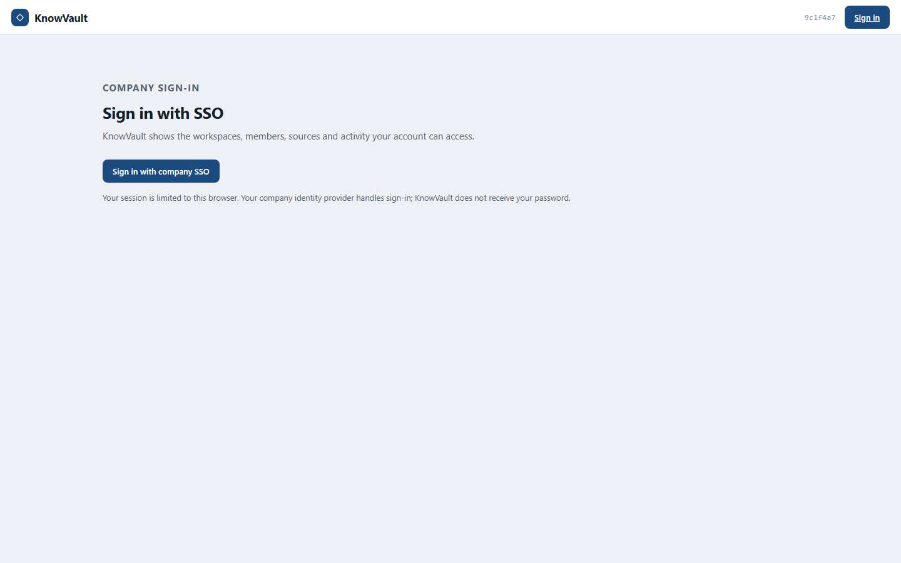
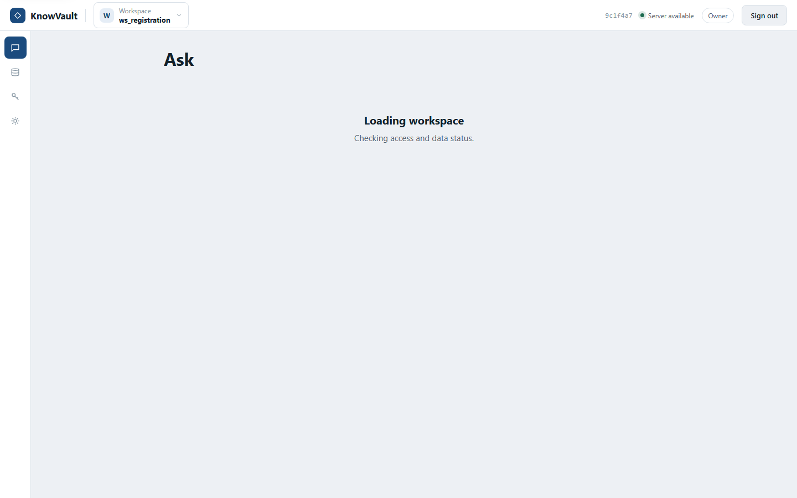
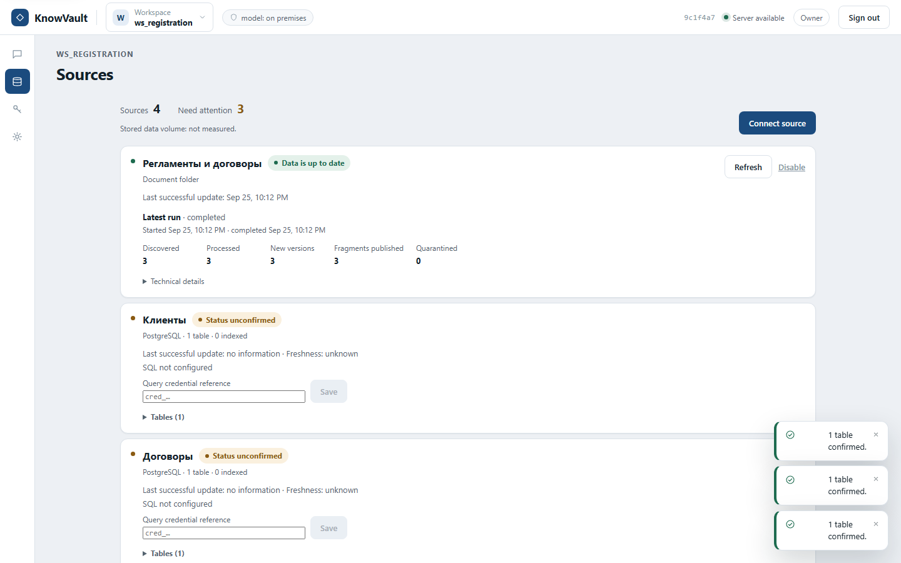
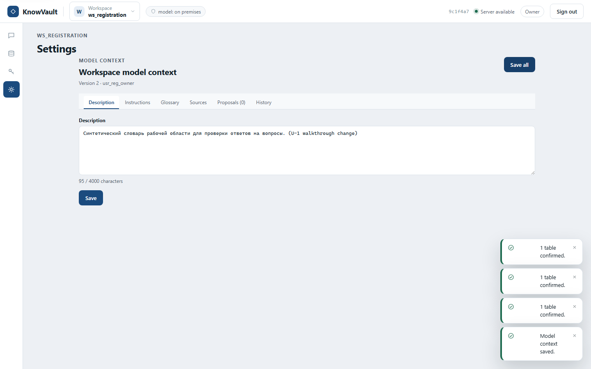
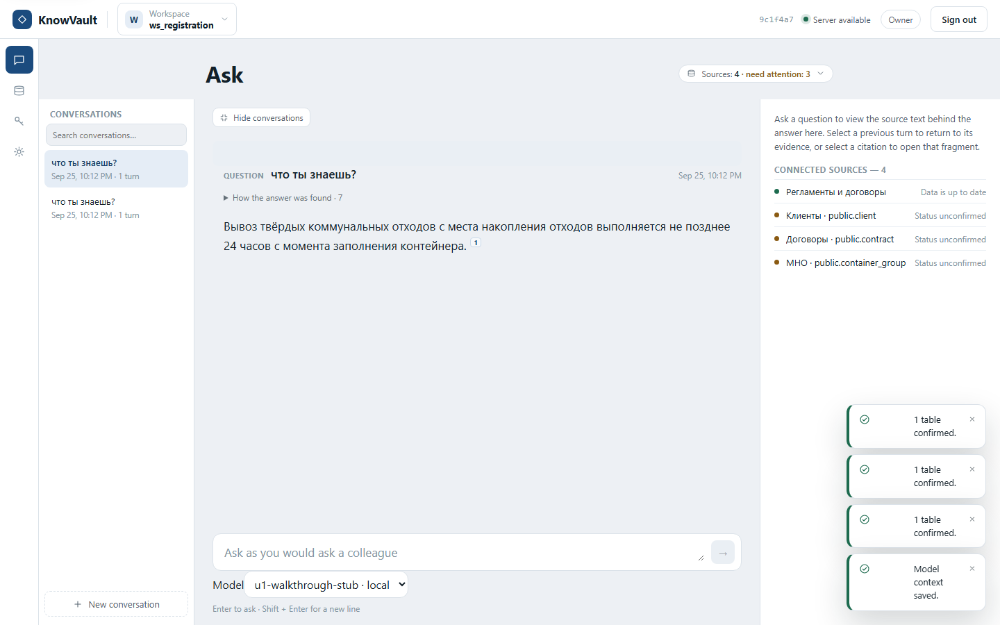
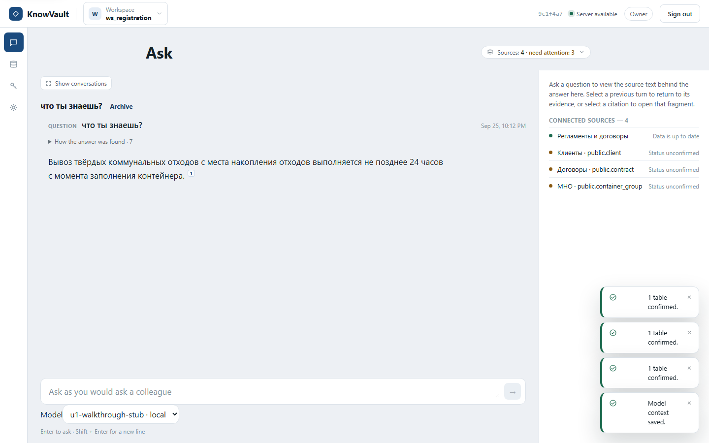
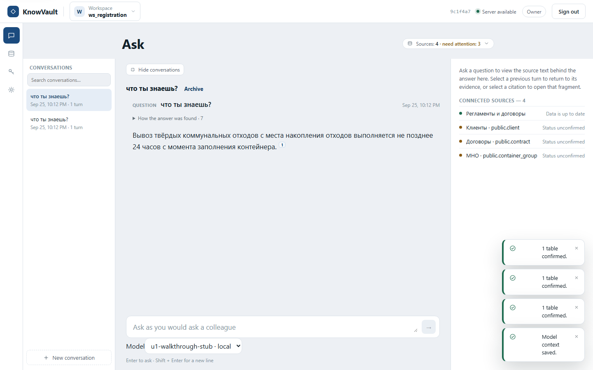
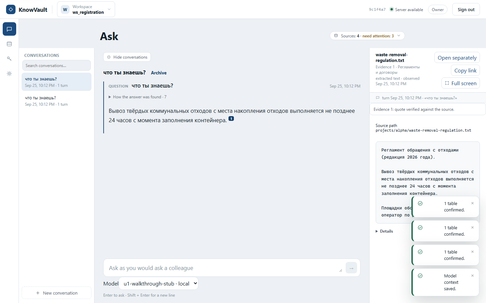
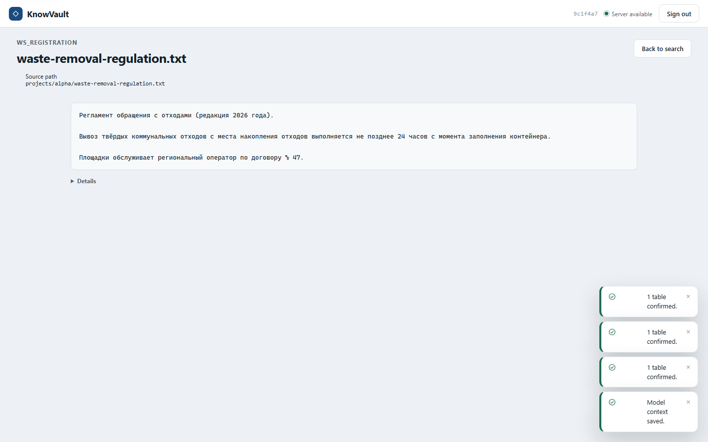

# Walkthrough report

A robot walked the real web interface of the local synthetic stand.

- Command: `bash tests/e2e/walkthrough/run-walkthrough.sh`
- Scenario: local
- Stand: https://127.0.0.1:55478
- Started: 2026-09-25T19:12:19.514Z
- Finished: 2026-09-25T19:12:22.893Z
- Total: 3.379 s
- Result: **PASS** (9 steps, 0 failed)

## Answers (1)

### что ты знаешь?

Вывоз твёрдых коммунальных отходов с места накопления отходов выполняется не позднее 24 часов с момента заполнения контейнера.

## Steps

### 1. the interface shows the running server revision — passed (0.13 s)

Mutating requests (0):

- none

HTTP responses >= 500 (0):

- none

Browser console errors (1):

- Failed to load resource: the server responded with a status of 401 (Unauthorized)

HTTP responses 400-499 (1):

- GET /api/v1/workspaces -> 401 (UNAUTHENTICATED)

### 2. sign in as the test user — passed (0.10 s)

Mutating requests (0):

- none

HTTP responses >= 500 (0):

- none

Browser console errors (1):

- Failed to load resource: the server responded with a status of 401 (Unauthorized)

HTTP responses 400-499 (1):

- GET /api/v1/workspaces -> 401 (UNAUTHENTICATED)

### 3. open Sources and confirm the synthetic database tables — passed (1.07 s)

Mutating requests (3):

- POST /api/v1/workspaces/ws_registration/managed-source-confirmations:batch
- POST /api/v1/workspaces/ws_registration/managed-source-confirmations:batch
- POST /api/v1/workspaces/ws_registration/managed-source-confirmations:batch

HTTP responses >= 500 (0):

- none

Browser console errors (0):

- none

### 4. open the model settings and save a change — passed (0.24 s)

Mutating requests (1):

- PUT /api/v1/workspaces/ws_registration/model-context

HTTP responses >= 500 (0):

- none

Browser console errors (0):

- none

### 5. ask the question in the chat and get an answer — passed (0.97 s)

Answer texts (1):

> что ты знаешь?
>
> Вывоз твёрдых коммунальных отходов с места накопления отходов выполняется не позднее 24 часов с момента заполнения контейнера.

Mutating requests (1):

- POST /api/v1/workspaces/ws_registration/questions

HTTP responses >= 500 (0):

- none

Browser console errors (0):

- none

### 6. collapse the conversation list — passed (0.04 s)

Mutating requests (0):

- none

HTTP responses >= 500 (0):

- none

Browser console errors (0):

- none

### 7. expand the conversation list again — passed (0.04 s)

Mutating requests (0):

- none

HTTP responses >= 500 (0):

- none

Browser console errors (0):

- none

### 8. open the evidence of that answer — passed (0.23 s)

Mutating requests (0):

- none

HTTP responses >= 500 (0):

- none

Browser console errors (0):

- none

### 9. open the source page of that answer — passed (0.20 s)

Mutating requests (0):

- none

HTTP responses >= 500 (0):

- none

Browser console errors (0):

- none

